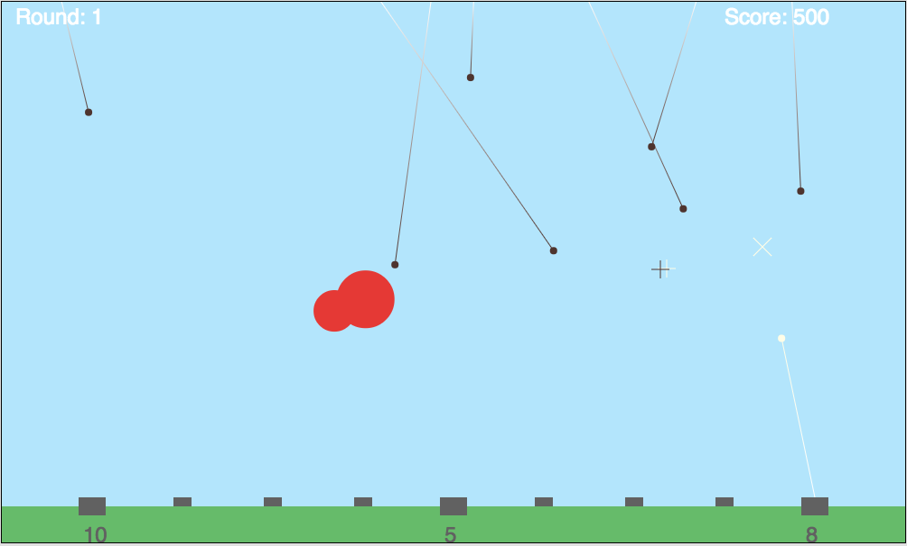

##Missile Command

[Play!][github_pages] **NB:**

[github_pages]: http://gregferg.github.io/missile_command/

Missile Command is based off the 1980 Missile Command game for the Atari.

## Instructions
1. Click on Live Link
2. Press Space to start a game
3. Click to fire missiles
4. Advance to the next round!

## Features

#### Efficient Missiles
The origin of the missile is decided based on the distance to the target from the closest missile base that still has remaining ammo.

#### Unlimited Rounds
The number of missiles increase every round, but the amount of ammo each missile base has does not change, forcing players to conserve ammo and place missiles the most efficiently to blow up as many incoming missiles as possible.
